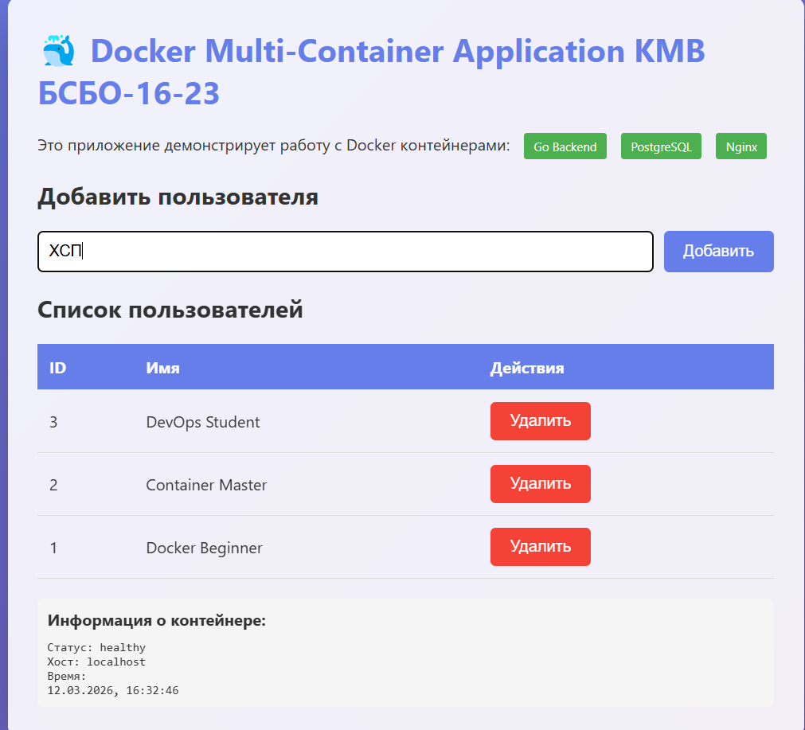
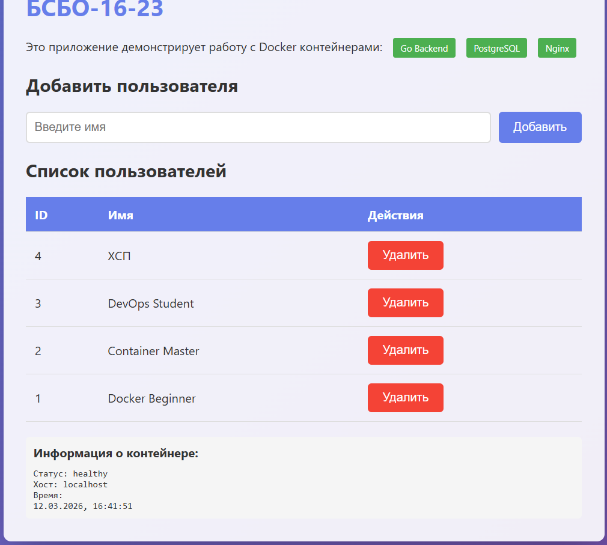
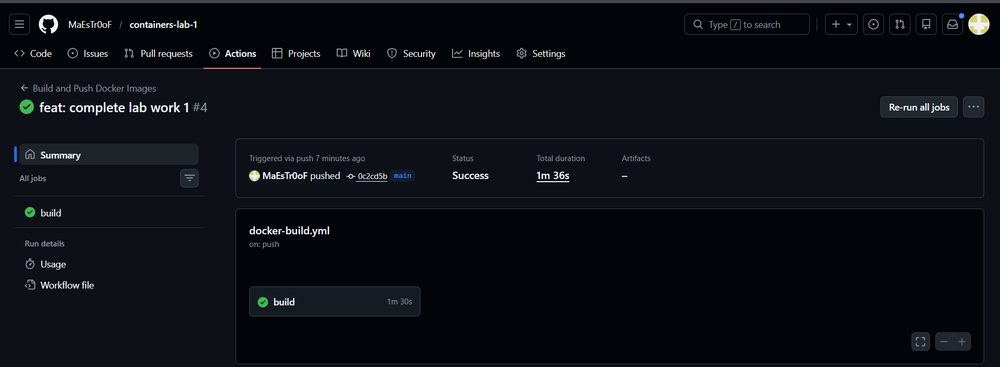
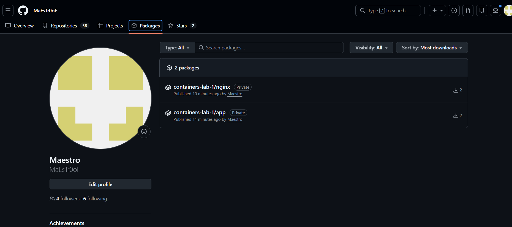

# Отчет по практической работе №1
## Студент: Хвальчев Сергей Павлович
## Группа: [БСБО-16-23]
## Дата выполнения: 12.03.2026

### 1. Выполненные команды Docker
#### 1.1 Работа с образами
```shell
PS C:\Users\user\Desktop\orkerst\containers-lab-1> docker pull nginx:alpine
alpine: Pulling from library/nginx
589002ba0eae: Pull complete
d2a46166eee6: Pull complete
593488f95c35: Pull complete
e19aff8f2cce: Pull complete
1549d7aec962: Pull complete
1f25242adbdb: Pull complete
c32126d2b96c: Pull complete
c24026275c33: Pull complete
Digest: sha256:f46cb72c7df02710e693e863a983ac42f6a9579058a59a35f1ae36c9958e4ce0
Status: Downloaded newer image for nginx:alpine
docker.io/library/nginx:alpine
1.21-alpine: Pulling from library/golang
c6a83fedfae6: Pull complete
41db7493d1c6: Pull complete
54bf7053e2d9: Pull complete
4579008f8500: Pull complete
4f4fb700ef54: Pull complete
Digest: sha256:2414035b086e3c42b99654c8b26e6f5b1b1598080d65fd03c7f499552ff4dc94
Status: Downloaded newer image for golang:1.21-alpine
docker.io/library/golang:1.21-alpine
```
#### 1.2 Работа с контейнерами
```shell
PS C:\Users\user\Desktop\orkerst\containers-lab-1> docker ps
CONTAINER ID   IMAGE                  COMMAND                  CREATED              STATUS                   PORTS                    NAMES
da5748cc5599   nginx:alpine           "/docker-entrypoint.…"   15 seconds ago       Up 15 seconds            0.0.0.0:8080->80/tcp     web-server
c637fa08fa41   alpine:latest          "sh"                     About a minute ago   Up About a minute                                 test-alpine
922a32349e2a   nginx:alpine           "/docker-entrypoint.…"   5 minutes ago        Up 5 minutes             0.0.0.0:80->80/tcp       lab1-nginx
c53ca72f0a4e   containers-lab-1-app   "./main"                 5 minutes ago        Up 5 minutes (healthy)   8080/tcp                 lab1-app
2d1704ef6ff8   postgres:15-alpine     "docker-entrypoint.s…"   5 minutes ago        Up 5 minutes (healthy)   0.0.0.0:5432->5432/tcp   lab1-postgres

PS C:\Users\user\Desktop\orkerst\containers-lab-1> docker ps -a
CONTAINER ID   IMAGE                  COMMAND                  CREATED              STATUS                   PORTS                    NAMES
da5748cc5599   nginx:alpine           "/docker-entrypoint.…"   15 seconds ago       Up 15 seconds            0.0.0.0:8080->80/tcp     web-server
c637fa08fa41   alpine:latest          "sh"                     About a minute ago   Up About a minute                                 test-alpine
922a32349e2a   nginx:alpine           "/docker-entrypoint.…"   5 minutes ago        Up 5 minutes             0.0.0.0:80->80/tcp       lab1-nginx
c53ca72f0a4e   containers-lab-1-app   "./main"                 5 minutes ago        Up 5 minutes (healthy)   8080/tcp                 lab1-app
2d1704ef6ff8   postgres:15-alpine     "docker-entrypoint.s…"   5 minutes ago        Up 5 minutes (healthy)   0.0.0.0:5432->5432/tcp   lab1-postgres

PS C:\Users\user\Desktop\orkerst\containers-lab-1> docker logs web-server
/docker-entrypoint.sh: /docker-entrypoint.d/ is not empty, will attempt to perform configuration
/docker-entrypoint.sh: Looking for shell scripts in /docker-entrypoint.d/
/docker-entrypoint.sh: Launching /docker-entrypoint.d/10-listen-on-ipv6-by-default.sh
10-listen-on-ipv6-by-default.sh: info: Getting the checksum of /etc/nginx/conf.d/default.conf
10-listen-on-ipv6-by-default.sh: info: Enabled listen on IPv6 in /etc/nginx/conf.d/default.conf
/docker-entrypoint.sh: Sourcing /docker-entrypoint.d/15-local-resolvers.envsh
/docker-entrypoint.sh: Launching /docker-entrypoint.d/20-envsubst-on-templates.sh
/docker-entrypoint.sh: Launching /docker-entrypoint.d/30-tune-worker-processes.sh
/docker-entrypoint.sh: Configuration complete; ready for start up
2026/03/12 13:34:36 [notice] 1#1: using the "epoll" event method
2026/03/12 13:34:36 [notice] 1#1: nginx/1.29.6
2026/03/12 13:34:36 [notice] 1#1: built by gcc 15.2.0 (Alpine 15.2.0)
2026/03/12 13:34:36 [notice] 1#1: OS: Linux 5.15.167.4-microsoft-standard-WSL2
2026/03/12 13:34:36 [notice] 1#1: getrlimit(RLIMIT_NOFILE): 1048576:1048576
2026/03/12 13:34:36 [notice] 1#1: start worker processes
2026/03/12 13:34:36 [notice] 1#1: start worker process 30
2026/03/12 13:34:36 [notice] 1#1: start worker process 31
2026/03/12 13:34:36 [notice] 1#1: start worker process 32
2026/03/12 13:34:36 [notice] 1#1: start worker process 33
2026/03/12 13:34:36 [notice] 1#1: start worker process 34
2026/03/12 13:34:36 [notice] 1#1: start worker process 35
2026/03/12 13:34:36 [notice] 1#1: start worker process 36
2026/03/12 13:34:36 [notice] 1#1: start worker process 37
2026/03/12 13:34:36 [notice] 1#1: start worker process 38
2026/03/12 13:34:36 [notice] 1#1: start worker process 39
2026/03/12 13:34:36 [notice] 1#1: start worker process 40
2026/03/12 13:34:36 [notice] 1#1: start worker process 41
```
### 1.3 Работа с томами и сетями
```shell
PS C:\Users\user\Desktop\orkerst> docker exec app-net ping -c 3 postgres-net
PING postgres-net (172.19.0.2): 56 data bytes
64 bytes from 172.19.0.2: seq=0 ttl=64 time=0.290 ms
64 bytes from 172.19.0.2: seq=1 ttl=64 time=0.059 ms
64 bytes from 172.19.0.2: seq=2 ttl=64 time=0.068 ms

--- postgres-net ping statistics ---
3 packets transmitted, 3 packets received, 0% packet loss
round-trip min/avg/max = 0.059/0.139/0.290 ms
```

#### 2.1 Главная страница

#### 2.2 Добавление пользователя

#### 2.3 Список пользователей в БД
```shell
PS C:\Users\user\Desktop\orkerst\containers-lab-1> docker exec -it lab1-postgres psql -U postgres -d myapp -c "SELECT * FROM users;"
 id |       name       |         created_at
----+------------------+----------------------------
  1 | Docker Beginner  | 2026-03-12 13:29:06.631259
  2 | Container Master | 2026-03-12 13:29:06.631259
  3 | DevOps Student   | 2026-03-12 13:29:06.631259
  4 | ХСП              | 2026-03-12 13:41:22.473989
(4 rows)

PS C:\Users\user\Desktop\orkerst\containers-lab-1>
```

### 3. GitHub Actions
#### 3.1 Успешный запуск workflow


#### 3.2 Опубликованные образы в GHCR


### 4. Выводы 
Познакомился с основами Docker и написанием многостадийных Dockerfile. Успешно настроил CI/CD пайплайн в GitHub Actions для автоматической сборки и публикации образов в GHCR. Столкнулся с ошибками конфигурации в методических указаниях, которые успешно разрешил путем отладки сети и параметров healthcheck.